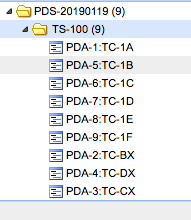

The idea is provide some simple and silly data that can be used  
to discuss issues with the users.  

TS-100.barebones.xml
Contains:
1 Test Suite TS-100
5 Test Cases (TC-1A,...,TC-1F) with 2 steps on each one.
3 Test Cases (TC-BX,TC-CX,TC-DX) without steps.
NO Keywords
NO Custom Fields
NO Attachments
NO Requirements

